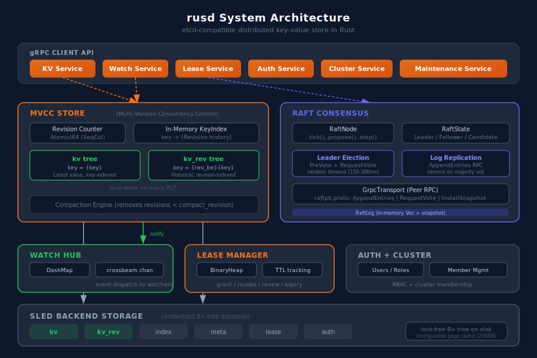

# rusd: A Rust Replacement for etcd

[](https://github.com/sreniatnoc/rusd/actions)
[](https://opensource.org/licenses/Apache-2.0)
[](https://www.rust-lang.org/)
[](https://kubernetes.io)

A high-performance, distributed key-value store written in Rust that serves as a drop-in replacement for etcd. rusd maintains full gRPC API compatibility with etcd v3, validated against Kubernetes v1.35 (34/34 compliance tests pass).

## Architecture



```
┌─────────────────────────────────────────────────────────────┐
│                    gRPC API Layer (tonic)                    │
│  KV · Watch · Lease · Auth · Cluster · Maintenance          │
└──────────────────────┬──────────────────────────────────────┘
                       │
┌──────────────────────┴──────────────────────────────────────┐
│                   Raft Consensus                            │
│  PreVote + Election · Log Replication · Peer gRPC Transport │
└──────────────────────┬──────────────────────────────────────┘
                       │
┌──────────────────────┴──────────────────────────────────────┐
│                MVCC Store (dual-write)                       │
│  kv tree (latest, key-indexed) · kv_rev tree (historical)   │
│  In-memory KeyIndex · Compaction Engine                     │
└──────────────────────┬──────────────────────────────────────┘
                       │
┌──────────────────────┴──────────────────────────────────────┐
│            sled Embedded Storage Backend                     │
│  Lock-free B+ tree · kv · kv_rev · index · meta · lease     │
└─────────────────────────────────────────────────────────────┘

┌──────────────────────────────────────────────┐ ┌────────────────────────┐
│  Watch Hub (DashMap + crossbeam channels)     │ │  Lease Manager (heap)  │
└──────────────────────────────────────────────┘ └────────────────────────┘
```

## Features

- **Drop-in etcd replacement**: Full gRPC API compatibility with etcd v3 (etcdserverpb)
- **MVCC with full revision history**: Dual-write to `kv` (latest) and `kv_rev` (historical) trees, supporting point-in-time reads and watch catchup
- **Transactions**: Compare-and-swap with all 5 compare targets (Value, Version, CreateRevision, ModRevision, LeaseId) and all 4 operators
- **Watch subsystem**: Real-time event streaming with prefix watches, prev_kv support, and revision-based catchup
- **Lease management**: TTL-based key expiration with proper key cleanup on revoke/expiry
- **Raft consensus**: Leader election with PreVote, log replication, peer gRPC transport (raftpb), deterministic member IDs
- **Authentication & RBAC**: User/role management with bcrypt passwords and JWT tokens
- **Kubernetes validated**: 34/34 K8s compliance tests pass on Kind v1.35

## Performance

Benchmarked head-to-head against etcd v3.6.7 on Apple Silicon (2026-02-09):

### etcdctl Microbenchmarks (1000 keys, sequential)

| Operation | rusd | etcd | Advantage |
|-----------|------|------|-----------|
| Sequential PUT | 107 ops/s | 68 ops/s | **1.56x faster** |
| Sequential GET | 141 ops/s | 139 ops/s | ~same |
| Range Query | 135 ops/s | 133 ops/s | ~same |
| Sequential DELETE | 140 ops/s | 81 ops/s | **1.73x faster** |
| Memory (RSS) | **21 MB** | 42 MB | **2x less** |

### Kubernetes Workload (Kind Cluster)

| Operation | rusd | etcd | Advantage |
|-----------|------|------|-----------|
| Deploy + Scale to 5 replicas | 1.5s | 15.9s | **10.3x faster** |
| Rolling Update (5 replicas) | 2.0s | 12.1s | **6.0x faster** |
| Create 50 ConfigMaps | 1.5s | 1.8s | **1.2x faster** |
| Binary size | 5.2 MB | ~23 MB | **4.4x smaller** |
| Startup time | ~30ms | ~500ms | **16x faster** |

See [docs/benchmark-results.md](docs/benchmark-results.md) for methodology and caveats.

## Quick Start

### Prerequisites

- Rust 1.70+ with `cargo`
- Protocol Buffers compiler (`protoc`)
- For Kubernetes: `kind`, `kubectl`, `etcdctl`

### Build and Run

```bash
git clone https://github.com/sreniatnoc/rusd.git
cd rusd
cargo build --release

# Start a single node
./target/release/rusd \
  --name node1 \
  --listen-client-urls http://0.0.0.0:2379 \
  --listen-peer-urls http://0.0.0.0:2380 \
  --initial-cluster "node1=http://127.0.0.1:2380"
```

### Use with etcdctl

```bash
export ETCDCTL_API=3
export ETCDCTL_ENDPOINTS=http://localhost:2379

etcdctl put mykey "Hello, World!"
etcdctl get mykey
etcdctl get /app/ --prefix
etcdctl watch /app/config &
etcdctl del mykey

# Transactions
etcdctl txn --interactive

# Leases
etcdctl lease grant 60
etcdctl put temp-key temp-val --lease=<ID>
etcdctl lease revoke <ID>

# Cluster info
etcdctl member list
etcdctl endpoint status
```

### Use as Kubernetes Backend (Kind)

```bash
# Start rusd on host
./target/release/rusd \
  --listen-client-urls http://0.0.0.0:2479 \
  --advertise-client-urls http://host.docker.internal:2479

# Create Kind cluster pointing to rusd
cat <<EOF | kind create cluster --name rusd-test --config -
kind: Cluster
apiVersion: kind.x-k8s.io/v1alpha4
networking:
  apiServerPort: 6443
nodes:
  - role: control-plane
    kubeadmConfigPatches:
      - |
        kind: ClusterConfiguration
        etcd:
          external:
            endpoints:
              - http://host.docker.internal:2479
EOF

kubectl get nodes
kubectl create deployment nginx --image=nginx:alpine
kubectl scale deployment nginx --replicas=3
```

## CLI Flags

```
GENERAL:
  --name <name>                          Node name (default: "default")
  --data-dir <path>                      Data directory (default: "./default.etcd")
  --listen-client-urls <urls>            Client listen URLs (default: "http://127.0.0.1:2379")
  --listen-peer-urls <urls>              Peer listen URLs (default: "http://127.0.0.1:2380")
  --advertise-client-urls <urls>         Client advertise URLs
  --initial-advertise-peer-urls <urls>   Peer advertise URLs
  --initial-cluster <spec>               Initial cluster specification
  --initial-cluster-state <state>        new|existing (default: "new")
  --initial-cluster-token <token>        Cluster token (default: "rusd-cluster")

TUNING:
  --heartbeat-interval <ms>              Raft heartbeat interval (default: 100)
  --election-timeout <ms>                Raft election timeout (default: 1000)
  --max-request-bytes <bytes>            Max request size (default: 1572864)
  --quota-backend-bytes <bytes>          Backend quota (default: 2147483648)
  --snapshot-count <count>               Snapshot every N entries (default: 100000)

LOGGING:
  --log-level <level>                    debug|info|warn|error (default: "info")
  --log-format <format>                  json|text (default: "text")
```

## Testing

```bash
# All tests (48 unit + 12 integration)
cargo test

# Unit tests only
cargo test --lib

# Integration tests (starts real gRPC server per test)
cargo test --test integration_test

# Multi-node tests (3-node Raft cluster)
./scripts/multi-node-test.sh

# TLS/mTLS tests
./scripts/tls-test.sh

# K8s compliance tests (requires Kind)
./scripts/k8s-test.sh

# Benchmarks (Criterion)
cargo bench
```

## Project Structure

```
src/
├── lib.rs              # Crate root, module declarations
├── main.rs             # CLI entry point (clap)
├── server/mod.rs       # Server orchestration, lease expiry, Raft startup
├── storage/
│   ├── backend.rs      # sled backend (kv, kv_rev, index, meta, lease, auth trees)
│   ├── mvcc.rs         # MVCC store with dual-write, historical reads, compaction
│   └── index.rs        # In-memory KeyIndex (key -> revision history)
├── raft/
│   ├── node.rs         # RaftNode: tick loop, election, log replication
│   ├── transport.rs    # GrpcTransport (peer RPCs) + MockTransport
│   └── mod.rs          # Raft types (LogEntry, RaftState, Config)
├── api/
│   ├── kv_service.rs   # KV gRPC service (Range, Put, DeleteRange, Txn, Compact)
│   ├── watch_service.rs# Watch gRPC service (streaming)
│   ├── lease_service.rs# Lease gRPC service (Grant, Revoke, KeepAlive, TimeToLive)
│   ├── auth_service.rs # Auth gRPC service (users, roles, RBAC)
│   ├── cluster_service.rs    # Cluster gRPC service (member list)
│   ├── maintenance_service.rs# Maintenance gRPC service (status, snapshot)
│   └── raft_internal_service.rs # Peer Raft RPCs (AppendEntries, RequestVote, InstallSnapshot)
├── watch/mod.rs        # WatchHub (DashMap + crossbeam channels)
├── lease/mod.rs        # LeaseManager (BinaryHeap-based TTL tracking)
├── auth/mod.rs         # AuthStore (users, roles, JWT)
└── cluster/mod.rs      # ClusterManager (member tracking)

proto/
├── etcdserverpb/       # etcd client API protos (KV, Watch, Lease, Auth, etc.)
└── raftpb/             # Raft peer-to-peer protos (AppendEntries, RequestVote, InstallSnapshot)
```

## Current Status

### Working
- Full KV API (Put, Get, Range, Delete, Txn with CAS)
- MVCC with full revision history and compaction
- Watch with prefix, prev_kv, and revision-based catchup
- Leases with proper key cleanup on revoke/expiry
- Auth with users, roles, and RBAC
- Raft consensus: leader election (PreVote), log replication, follower forwarding, failover
- Multi-node Raft: 3-node clusters with real gRPC peer transport (7/7 tests pass)
- TLS/mTLS support (rustls) with cert-based authentication (8/8 tests pass)
- Deterministic member IDs (stable across restarts)
- Kubernetes 34/34 compliance tests (Kind v1.35)
- Snapshot transfer (InstallSnapshot RPC) for follower catchup
- Dynamic cluster membership (add/remove/promote via Raft ConfigChange)
- Defragmentation, hash verification (CRC32)
- Snapshot streaming via Maintenance API (etcdctl snapshot save compatible)
- Chaos tested: leader kill + recovery, data integrity under node churn (11/11 pass)
- CI: 8 jobs all green (unit, integration, multi-node, K8s, TLS, benchmarks, lint)
- **24/24 etcd API compatibility**

### Roadmap
- etcd e2e test suite compatibility
- Jepsen-style linearizability testing
- Multi-node Kubernetes (3-node rusd backing Kind cluster)
- Snapshot compaction and automatic log truncation

## License

Apache License 2.0. See [LICENSE](LICENSE).

## Acknowledgments

- [Tokio](https://tokio.rs/) async runtime
- [tonic](https://github.com/hyperium/tonic) gRPC framework
- [sled](https://github.com/spacejam/sled) embedded database
- [etcd](https://github.com/etcd-io/etcd) protocol definitions
